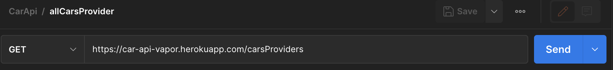
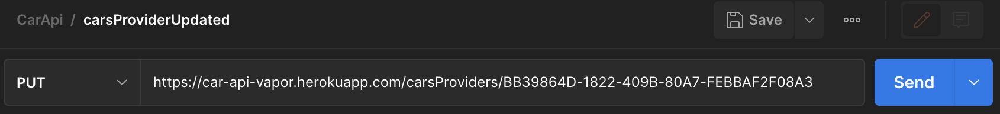
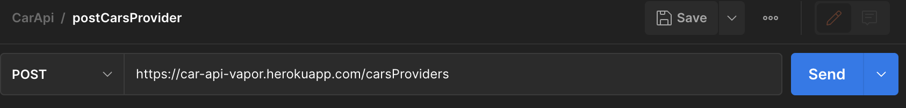
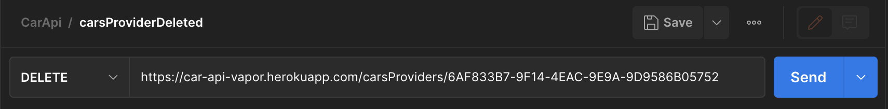
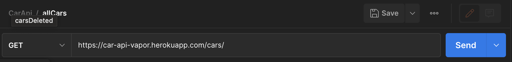
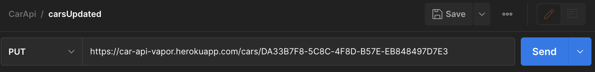
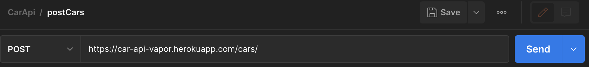
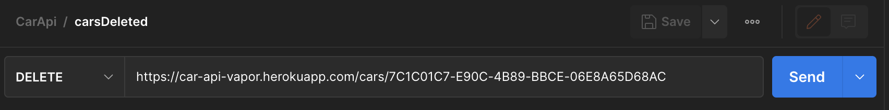

# CarsApi
# Solution Concept :
Help users to find the best car based on several criteria 
# App Statement :
Creating Api to help users to find the best car : https://car-api-vapor.herokuapp.com/cars/
# Feature List :
- Get all Cars Providers category

- Update Cars Provider info

- Add Cars Provider

- Delete Cars Provider

- Get all Cars category

- Update Car info

- Add new Car

- Delete Car

# Database Schema For Cars

# Database Schema For Cars Provider

# Technologies & Tools:
- Xcode
- Vapor
- Postgres.app
- pgAdmin
- Postico 2

